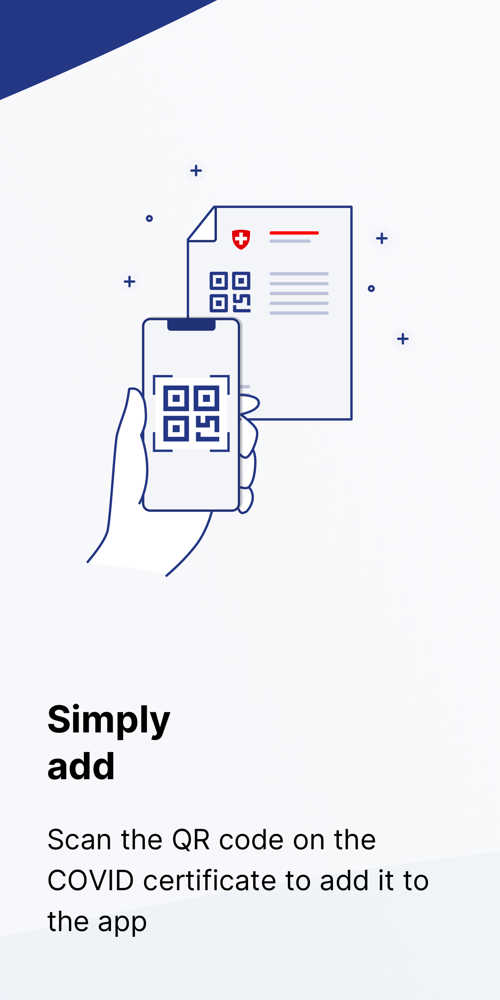
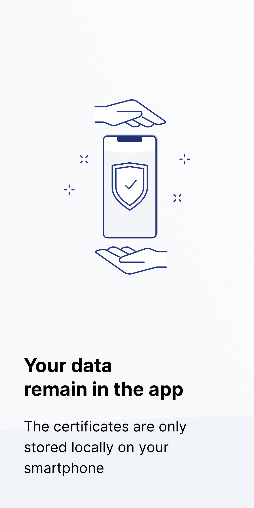
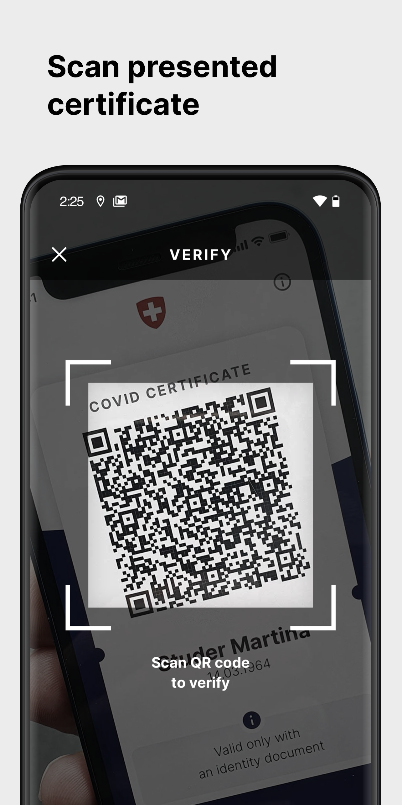
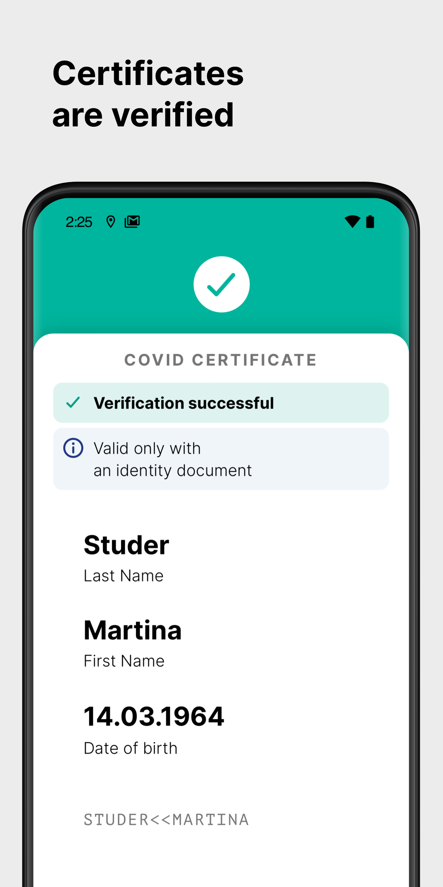

# COVID Certificate App and COVID Certificate Check App for Switzerland

[](https://github.com/DP-3T/dp3t-app-android-ch/blob/master/LICENSE)


This project is released by the the Federal Office of Information Technology, Systems and Telecommunication FOITT
on behalf of the Federal Office of Public Health FOPH.
The app design, UX and implementation was done by [Ubique](https://www.ubique.ch?app=github).

## COVID Certificate App

COVID Certificate is the official app for storing and presenting Swiss COVID certificates.
The certificates are kept and checked locally on the user's phone.

<p align="center">




</p>

## COVID Certificate Check App

COVID Certificate Check is the official app for checking COVID certificates in Switzerland.
The validation is executed locally on the phone and no information of the scanned certificates is saved.

<p align="center">



</p>

## Contribution Guide

This project is truly open-source and we welcome any feedback on the code regarding both the implementation and security aspects.

Bugs or potential problems should be reported using Github issues.
We welcome all pull requests that improve the quality of the source code.
Please note that the app will be available with approved translations in English, German, French, Italian.

## Repositories

* iOS SDK: [CovidCertificate-SDK-iOS](https://github.com/admin-ch/CovidCertificate-SDK-iOS)
* Android App: [CovidCertificate-App-Android](https://github.com/admin-ch/CovidCertificate-App-Android)
* iOS App: [CovidCertificate-App-iOS](https://github.com/admin-ch/CovidCertificate-App-iOS)
* Config Service: [CovidCertificate-App-Config-Service](https://github.com/admin-ch/CovidCertificate-App-Config-Service)

## Installation and Building

The project can be opened with Android Studio 4.1.2 or later or you can build the project with Gradle using
```sh
$ ./gradlew assembleProdRelease
```
The APK is generated under app/build/outputs/apk/prod/release/package-prod-release.apk

## Reproducible builds

To verify that the app distributed on the Play Store was built by the source code published here, please see the instructions
in [REPRODUCIBLE_BUILDS.md](REPRODUCIBLE_BUILDS.md).

## License

This project is licensed under the terms of the MPL 2 license. See the [LICENSE](LICENSE) file for details.
