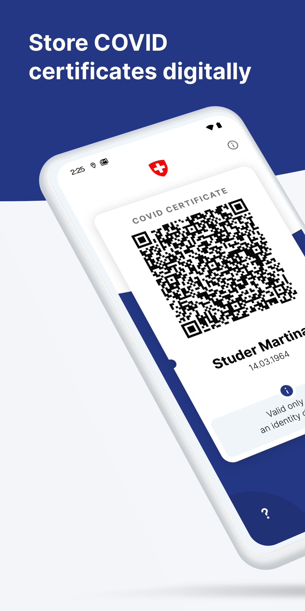
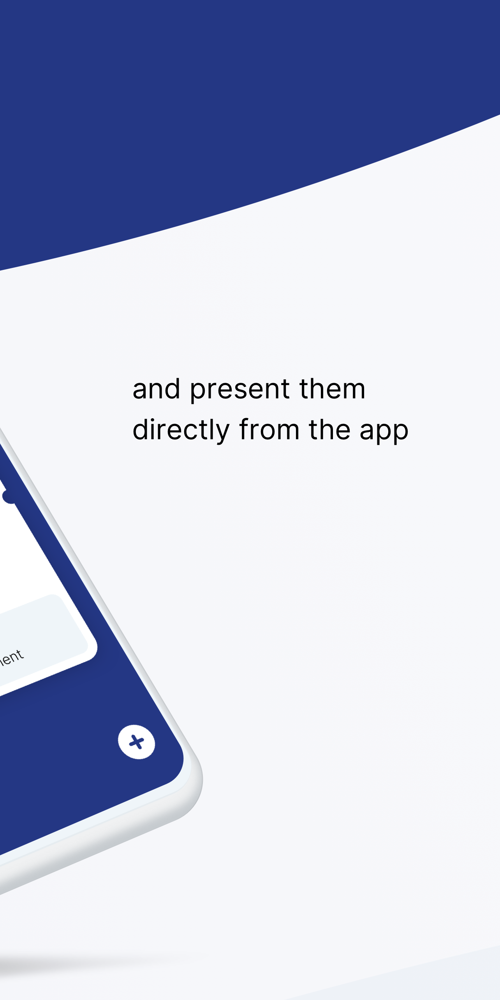
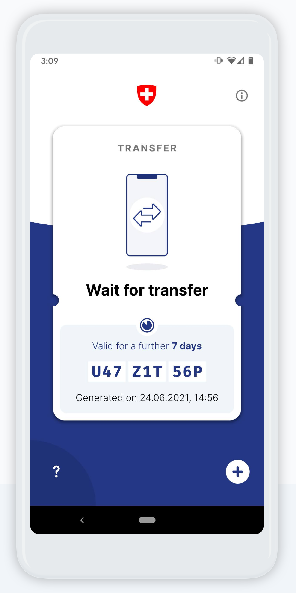
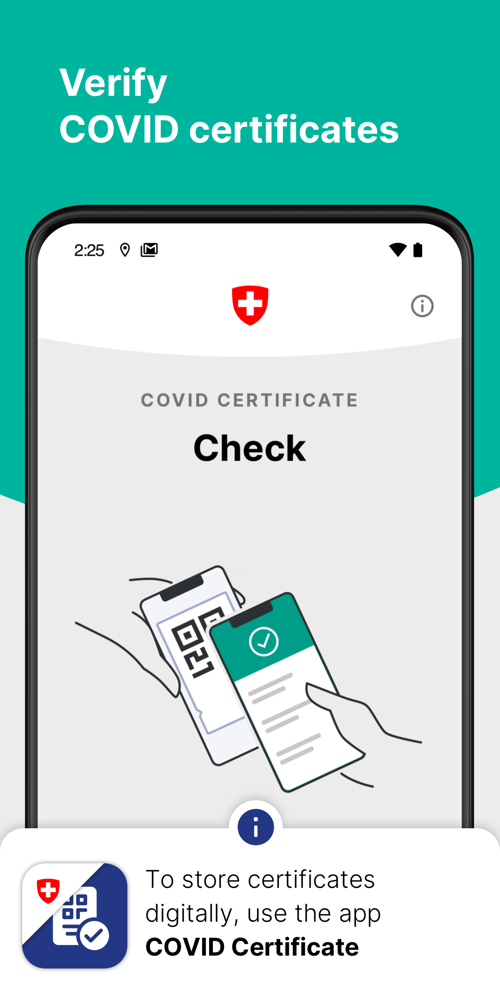

# COVID Certificate Apps - Android

[](https://github.com/admin-ch/CovidCertificate-App-Android/blob/main/LICENSE)


This project is released by the the [Federal Office of Information Technology, Systems and Telecommunication FOITT](https://www.bit.admin.ch/)
on behalf of the [Federal Office of Public Health FOPH](https://www.bag.admin.ch/).
The app design, UX and implementation was done by [Ubique](https://www.ubique.ch?app=github).

## COVID Certificate App

COVID Certificate is the official app for storing and presenting COVID certificates issued in Switzerland.
The certificates are kept and checked locally on the user's phone.

<p align="verticalcenter">
<a href='https://play.google.com/store/apps/details?id=ch.admin.bag.covidcertificate.wallet'>

</a>
<a href='https://f-droid.org/packages/ch.admin.bag.covidcertificate.wallet'>

</a>
<a href='https://appgallery.huawei.com/#/app/C104434571'>

</a>
</p>

<p align="center">





</p>

## COVID Certificate Check App

COVID Certificate Check is the official app for checking COVID certificates in Switzerland.
The validation is executed locally on the phone and no information of the scanned certificates is saved.

<p align="verticalcenter">
<a href='https://play.google.com/store/apps/details?id=ch.admin.bag.covidcertificate.verifier'>

</a>
<a href='https://f-droid.org/packages/ch.admin.bag.covidcertificate.verifier'>

</a>
<a href='https://appgallery.huawei.com/#/app/C104435637'>

</a>
</p>

<p align="center">



</p>

## Contribution Guide

This project is truly open-source and we welcome any feedback on the code regarding both the implementation and security aspects.

Bugs or potential problems should be reported using Github issues.
We welcome all pull requests that improve the quality of the source code.
Please note that the app will be available with approved translations in English, German, French, Italian, Rumantsch.

## Repositories

* Android App: [CovidCertificate-App-Android](https://github.com/admin-ch/CovidCertificate-App-Android)
* Android SDK: [CovidCertificate-SDK-Android](https://github.com/admin-ch/CovidCertificate-SDK-Android)
* iOS App: [CovidCertificate-App-iOS](https://github.com/admin-ch/CovidCertificate-App-iOS)
* For all others, see the [Github organisation](https://github.com/admin-ch/)

## Installation and Building

The apps require at least Android 6 (Marshmallow).

Make sure to properly check out the submodule: `git submodule update --init`.

The project can be opened with Android Studio 4.1.2 or later.
Alternatively, you can build the respective apps using Gradle:
```sh
$ ./gradlew verifier:assembleProdRelease
$ ./gradlew wallet:assembleProdRelease
```
Note that in order for that to work, you must have set up your own keystore.

The APK is generated under `app/build/outputs/apk/prod/release/app-prod-release.apk` where `app` is one of: `verifier`, `wallet`.

## Reproducible builds

To verify that the app distributed on the Play Store was built by the source code published here, please see the instructions
in [REPRODUCIBLE_BUILDS.md](REPRODUCIBLE_BUILDS.md).

## License

This project is licensed under the terms of the MPL 2 license. See the [LICENSE](LICENSE) file for details.
